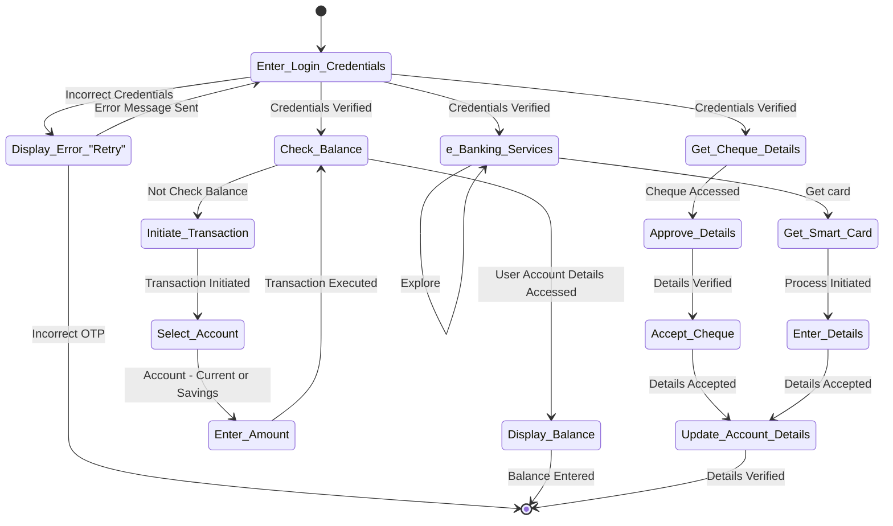

# online-banking
This repository covers a deep research of how an *__Online Banking System__* must work by incorporating software engineering methods(Agile) and the implementation of the same is in progress

---

## Group Members and Roles

| Name                 | Roll Number      | Roles              |
| -------------------- |:----------------:| ------------------:|
| Anush Karthik S      | CB.EN.U4CSE19205 | Software Developer |
| Darshan S            | CB.EN.U4CSE19212 | Tester             |
| Shaik Kaleem Ahmed   | CB.EN.U4CSE19244 | Business Analyst   |
| Suvethaa E           | CB.EN.U4CSE19249 | Software Developer |
| V Amrith             | CB.EN.U4CSE19254 | Project Manager    |

---

## Suporting Documents for the project
* [Abstract](https://docs.google.com/document/d/19u9l8FM4YKAaPwa9umkOwkrydLsN1Qx6xRok5kaB-cM/edit?usp=sharing)
* [Requirements Document](https://docs.google.com/document/d/1hZLo0QTXcVFVG5qjXkp8xkLGYx4IKEB-SSgove7pcT4/edit?usp=sharing)
* [Invision Chart](https://projects.invisionapp.com/freehand/document/4MjscbHc7)
* [Figma](https://www.figma.com/file/BucZkbnXP6R8xBBYZw70r4/Form?node-id=3%3A167)
* [Weekly Meeting Log](https://docs.google.com/document/d/19u9l8FM4YKAaPwa9umkOwkrydLsN1Qx6xRok5kaB-cM/edit?usp=sharing)

---

## Progress
- [x] Requirements Document
- [x] Wireframing and Prototyping
- [ ] Website Building

---

## State Diagram

